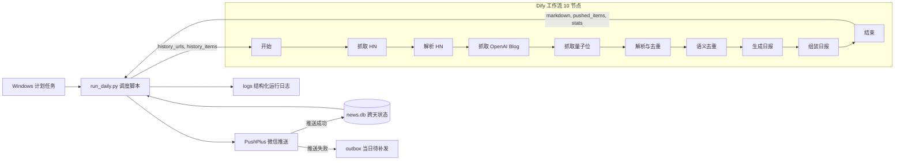

# AI 资讯聚合日报工作流

用 Dify 工作流把 Hacker News、OpenAI Blog 与量子位三个源，每天定时收敛成一条中文 Markdown 日报，推送到微信。

关注 AI 动态的人每天要打开三个以上站点，人工筛选耗时 30 至 60 分钟，还要自己判断哪些是同一件事的重复报道。这个项目把这条链路做成一次自动运行：定时触发 → 三源采集 → URL 归一化去重 → 语义去重 → 大模型写分档日报 → 微信推送 → 跨天状态写回。读者在微信里读一条消息，5 分钟内掌握当日要点。

## 技术构成

| 层 | 实现 |
| --- | --- |
| 工作流 | Dify 1.17.1 Workflow，10 个节点，DSL 随仓库提供：[`dify-ai-news-v1.yml`](dify-ai-news-v1.yml) |
| 模型 | DeepSeek `deepseek-flash` 对话模型，温度 0.3，失败重试 2 次并指数退避 |
| 调度与状态 | Python 3.12 标准库 + Windows 计划任务 + 本地 SQLite 单文件 |
| 推送 | PushPlus 接口发送微信富文本 |
| 浏览器侧 | Edge Manifest V3 扩展，把手动选中的网页正文推送到本地接收端 |
| 运行环境 | Docker Desktop + WSL2 在本机运行 Dify 全家桶（PostgreSQL 15、Redis 6、Weaviate 1.39） |

## 工作流链路



工作流本身无状态，跨天状态、推送与日志全部放在外层调度脚本里。这样划分的原因是 Dify 的 HTTP 节点只看 HTTP 状态码，而 PushPlus 这类接口在业务失败时依然返回 200；把推送放在脚本里可以直接读取响应体的状态字段，推送失败就不写历史、只落盘待补发。

**· 十个节点各做什么**

| 节点 | 类型 | 职责 |
| --- | --- | --- |
| `start_node` 开始 | start | 接收调度脚本传入的 `history_urls` 与 `history_items` 两个历史入参 |
| `http_hn` 抓取 HN | http-request | 请求 Algolia 接口取 Hacker News 首页 30 条，一次返回整份列表，无需循环与翻页 |
| `code_hn` 解析 HN 列表 | code | 清洗字段、为无链接的讨论帖补全地址、把发布时间换算为北京时间，输出结构化列表 |
| `http_openai` 抓取 OpenAI Blog | http-request | 请求 OpenAI 官方博客 RSS |
| `http_qbitai` 抓取量子位 | http-request | 请求量子位 RSS |
| `code_parse` 解析与去重 | code | 合并三源、URL 归一化去重、过滤跨天已推送条目、按来源配额选条，输出北京日期 `run_date` |
| `code_semantic` 语义去重 | code | 把标题与摘要编码成向量，与历史条目和本批条目做余弦比对，按双阈值判重或标记疑似 |
| `llm_sum` 生成日报 | llm | 调用 DeepSeek `deepseek-flash`，温度 0.3，按四档写中文 Markdown 日报 |
| `code_build` 组装日报 | code | 剥离推理块与代码围栏、抽出真正引用的链接，模型输出不可用时按来源权重保底渲染 |
| `end_node` 结束 | end | 导出 `markdown`、`count`、`pushed_urls`、`pushed_items`、`stats`、`semantic_stats` |

## 实测运行数据

数据来源是 `scheduler/logs/` 下的真实运行日志。

**· 最近一次完整运行（2026-10-08 15:51，状态 succeeded）**

- 三源抓取 1295 条，其中 Hacker News 30 条、OpenAI Blog 1255 条、量子位 10 条。
- URL 归一化去重后 1267 条，剔除 28 条跨源同链接重复。
- 按来源配额入选 15 条，每个源 5 条，避免产量大的源挤掉其他源。
- 语义去重保留 15 条，未命中跨天历史重复。
- 生成日报 9 条并推送成功，PushPlus 返回消息 id `e0db2f3572e54de0859f7b6d11944c50`。

**· 连续三次运行**

| 运行时间 | 状态 | 耗时 | Token 用量 | 三源抓取 | 入选条数 | 日报条数 |
| --- | --- | --- | --- | --- | --- | --- |
| 2026-10-07 18:51 | succeeded | 19.0 秒 | 3819 | 1281 | 15 | 12 |
| 2026-10-08 14:43 | succeeded | 62.3 秒 | 14814 | 1285 | 15 | 13 |
| 2026-10-08 15:51 | succeeded | 30.9 秒 | 7850 | 1295 | 15 | 9 |

三次运行的耗时为 19.0 至 62.3 秒，Token 用量为 3819 至 14814，均低于 PRD 设定的 10 分钟与 1 美元上限。日报条数落在 8 至 15 条的设计区间内。

## 日报的输出结构

日报的格式由提示词固定，读者在微信里看到的是纯文本 Markdown 富文本，不是需要二次加工的 JSON。

```markdown
# AI 日报 · 2026-10-08

> 共 9 条 · 来源：HN / OpenAI Blog / 量子位

## 今日头条

### 1. <中文标题> · 重要性 5/5
<1 至 3 句中文摘要>
来源：<来源> · [原文](<url>)

## 重要进展

### 2. <中文标题> · 重要性 4/5
<1 至 3 句中文摘要>
来源：<来源> · [原文](<url>)

## 值得关注

### 3. <中文标题> · 重要性 3/5
<1 至 3 句中文摘要>
来源：<来源> · [原文](<url>)

## 链接汇总

- [<中文标题>](<url>) — <来源> · 3/5
```

提示词里写死的约束有四条。其一是只依据输入内容写作，不得补充外部知识、编造事实与链接，原文链接必须原样使用输入里的 url。其二是英文标题翻译成 30 字以内的中文标题，中文标题只在明显啰嗦时精简。其三是 1 至 5 的重要性评分判断事件本身的分量而非来源权重：5 分为重大模型或产品发布等格局级事件，4 分为重要的能力或产品更新，3 分为有价值的进展、研究或观点，2 分为常规资讯，1 分为边缘内容。其四是某一档没有内容时写「今日无」，保留分档标题而不是删掉它。

每条固定按「标题（含评分）→ 摘要 → 来源与原文链接」的顺序展示。今日头条只放评分最高的 1 至 2 条且评分须达到 4，重要进展放其余评分 4 至 5 的条目且最多 5 条，值得关注放评分 1 至 3 的条目且最多 6 条，链接汇总按同样顺序列出本次进入日报的每一条。

## 实现要点

**· 两级去重**

第一级是 URL 归一化：补全协议头、小写主机名、折叠 `www.` 与 `m.` 前缀、剔除 `utm_*`、`fbclid`、`ref` 等跟踪参数、去掉路径末尾斜杠与锚点，得到唯一的去重键。第二级是语义去重：把标题（权重加倍）与摘要片段编码成向量，与历史条目和本批已保留条目逐一计算余弦相似度，每条取相似度最高的 5 个候选参与判定，达到 0.90 判为重复并丢弃，落在 0.80 至 0.90 区间标记为疑似重复并交给日报生成节点裁决，同源条目阈值自动加严 0.03。

编码器是可插拔的。未传入模型向量时使用工作流内置的确定性词法编码器，这覆盖同语言改写（实测相似度 0.84 至 1.00），但抓不到跨语言同事件（英文原文与中文报道的相似度只有 0.07 至 0.30）。节点已经留好 `embeddings` 入参入口，接入外部 embedding 模型后命中的条目自动改用模型向量，未命中的继续用词法编码器兜底；在接入之前，跨语言重复由日报生成节点的「同一件事只保留信息最完整的一条」规则兜底，不会漏推，只是偶发重复占版面。

**· 日报生成的保底渲染**

大模型按固定四档写日报：今日头条、重要进展、值得关注、链接汇总。每条包含 30 字以内的中文标题、1 至 3 句摘要、1 至 5 的重要性评分、来源与原文链接，提示词要求只依据输入内容写作。当模型输出为空、不是分档日报或重试后仍失败时，按来源权重与热度拼一份朴素日报并标注原因；无论走哪条路径都先剥掉推理块与代码围栏，避免把思考过程推到读者面前。宁可推朴素版本，也不推空消息。

**· 抓取节点的浏览器 User-Agent**

三个抓取节点的请求头写死了浏览器 User-Agent。Dify 的 HTTP 节点默认发送 `python-httpx`，量子位的 CDN 会直接返回 403 与空 body，而节点状态仍然是 `succeeded`，只表现为某个源静默少一条。从容器里换 User-Agent 请求同一个地址即返回 200，因此问题不在网络也不在 feed 地址。

**· 同类问题的预防**

工作流里三处单一来源——Hacker News 解析节点、语义去重节点、日报提示词——由同步脚本写入工作流定义，知识手册与实现不会各说各话。`tools/validate_dsl.py` 额外校验 YAML 结构、节点连线、变量引用、结束节点导出字段、URL 归一化在两侧实现的一致性，并真实执行四个代码节点验证输出。

## 我做了什么

**· 工作流设计**

在 Dify 上设计并实现 10 个节点的完整链路，覆盖定时触发、三源采集、字段清洗、两级去重、大模型生成、保底渲染与结果组装，并导出可一键导入的 DSL。

**· 去重与排序策略**

实现 URL 归一化去重与向量相似度去重两级策略，加上按来源配额的选条规则，把 1295 条原始资讯收敛为 15 条候选。

**· 调度与状态**

用 Python 3.12 标准库实现调度脚本，负责触发工作流、调用推送接口、维护 SQLite 跨天状态库、推送失败落盘待补发与运行日志，配套 Windows 计划任务实现无人值守。

**· 质量保障工具链**

实现工作流静态校验、单一来源同步、真实源冒烟、端到端串联测试与周报巡检五类工具，以及 Hacker News 解析节点的 45 条单元测试。

**· 浏览器侧采集**

实现 Manifest V3 的 Edge 扩展，把当前标签页的正文与元信息抽取成 Markdown、纯文本或 JSON，可直接复制、下载或推送到本地接收端。

## 项目结构

| 路径 | 作用 |
| --- | --- |
| `dify-ai-news-v1.yml` | Dify 工作流 DSL，导入即得完整 10 节点链路 |
| `prompts/` | 日报提示词的唯一来源 |
| `scheduler/` | 调度脚本、计划任务安装脚本、状态库与日志目录 |
| `dify-hn-workflow/` | Hacker News 解析节点、语义去重节点的源码与单元测试 |
| `tools/` | 校验、同步、冒烟、周报、状态库与本地接收端等工具 |
| `edge-page-reader/` | Edge Manifest V3 网页取用扩展 |
| `out/` | Dify 应用备份与导入校验结果 |
| `archive/` | 历史快照：导入前的旧版 Dify 应用导出，含早期已被替换的飞书推送节点 |
| `PRD.md` | 产品需求文档，含 21 条功能点与 KPI 定义 |

**· 调度脚本支持的运行模式**

```bash
python scheduler/run_daily.py              # 正常跑一次
python scheduler/run_daily.py --dry-run    # 只检查配置与历史，不调用 Dify
python scheduler/run_daily.py --no-push    # 真跑工作流看结果，但不推送、不写历史
python scheduler/run_daily.py --no-history # 忽略历史强制重跑
```

**· 巡检入口**

```bash
python tools/validate_dsl.py        # 校验工作流结构与代码节点是否漂移
python tools/smoke_real_sources.py  # 本地联网抓三个源，区分源站问题与工作流问题
python tools/weekly_report.py       # 读运行日志出周报：漏斗、源质量、阈值评估
python tools/news_store.py --stats  # 看窗口内按天按源的统计
```

## 本地运行

Dify 通过 Docker Desktop 与 WSL2 在本机运行，不使用任何云服务。首次部署按下面顺序执行。

```bash
run-01-enable-wsl.cmd              # 启用 WSL2
run-02-install-docker-and-dify.cmd # 安装 Docker Desktop 并拉起 Dify
```

启动后在 Dify 导入 `dify-ai-news-v1.yml`，把 `scheduler/config.example.json` 复制为 `scheduler/config.json` 并填入 API 密钥与推送令牌，然后运行调度脚本。`scheduler/config.json` 已写入 `.gitignore`，密钥不会进版本库。

## 文档

| 文档 | 内容 |
| --- | --- |
| [`PRD.md`](PRD.md) | 需求背景、21 条功能点、交互流程、KPI 与版本迭代计划 |
| [`dify-hn-workflow/README.md`](dify-hn-workflow/README.md) | Hacker News 解析节点的变量契约、处理规则与本地跑测方法 |
| [`edge-page-reader/README.md`](edge-page-reader/README.md) | 浏览器扩展的安装、用法与推送接口结构 |

<!-- 截图区：把真实的 Dify 画布截图另存为 docs/images/dify-canvas.png，把微信里收到的日报另存为 docs/images/wechat-daily-report.png，建好 docs/images/ 目录后删掉这一整段注释符号即可显示。

## 运行截图


-->
